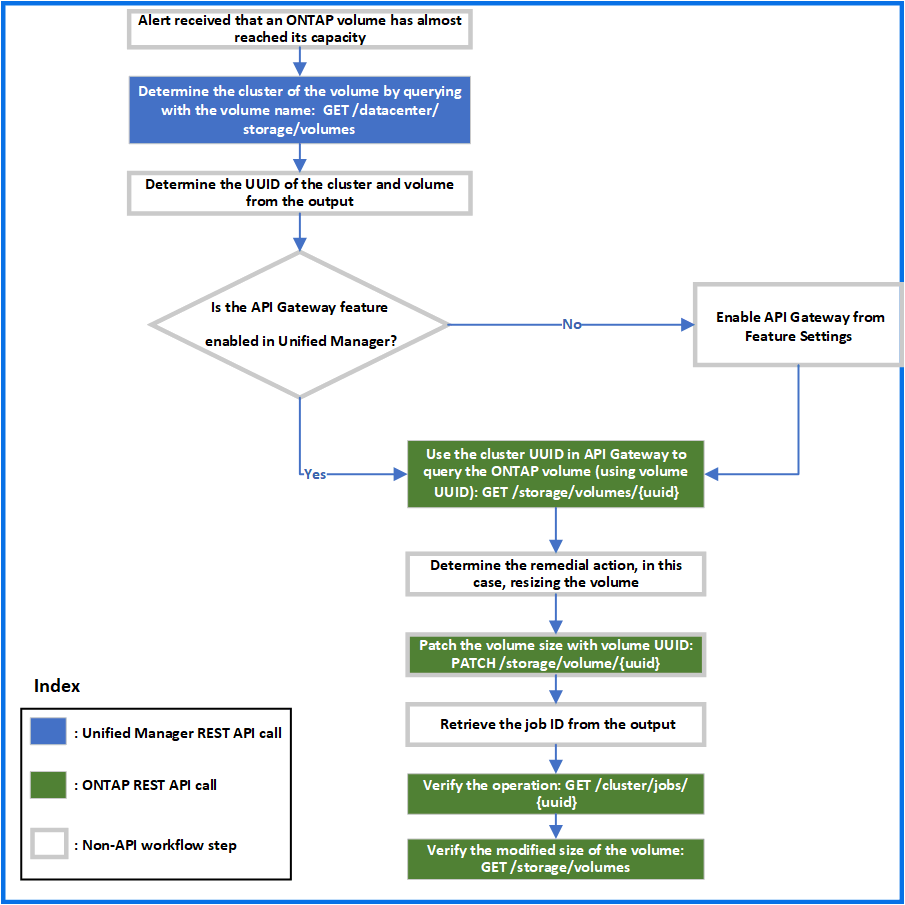

= Risoluzione dei problemi relativi ai volumi ONTAP utilizzando le API del gateway
:allow-uri-read: 
:icons: font
:imagesdir: ../media/

[role="lead"]
Le API del gateway fungono da gateway per richiamare le API ONTAP per eseguire query sulle informazioni relative agli oggetti di storage ONTAP e adottare misure correttive per risolvere i problemi segnalati.

Questo flusso di lavoro prende in esame un caso di utilizzo di esempio in cui un evento viene generato quando un volume ONTAP raggiunge quasi la sua capacità. Il flusso di lavoro dimostra anche come risolvere questo problema richiamando una combinazione di API REST Active IQ Unified Manager e ONTAP.

[NOTE]
====
Prima di eseguire le fasi del flusso di lavoro, assicurarsi che:

* Conosci le API del gateway e il loro utilizzo. Per ulteriori informazioni, vedere link:concept_gateway_apis.html["Accesso alle API ONTAP tramite accesso proxy"].
* Sei a conoscenza dell'utilizzo delle API REST di ONTAP. Per informazioni sull'utilizzo delle API REST di ONTAP, vederehttps://docs.netapp.com/us-en/ontap-automation/index.html["Documentazione sull'automazione ONTAP"].
* Sei un amministratore dell'applicazione.
* Il cluster su cui si desidera eseguire le operazioni API REST è supportato da ONTAP 9.5 o versione successiva e il cluster viene aggiunto a Unified Manager su HTTPS.

====
Il seguente diagramma illustra ogni fase del flusso di lavoro per la risoluzione dei problemi relativi all'utilizzo della capacità del volume ONTAP.

Il flusso di lavoro copre i punti di richiamo delle API REST di Unified Manager e ONTAP.

. Annotare il nome del volume dell'evento che notifica l'utilizzo della capacità del volume.
. Utilizzando il nome del volume come valore nel parametro name, eseguire una query sul volume eseguendo la seguente API di Unified Manager.
+
[cols="3*"]
|===
| Categoria | Verbo HTTP | Percorso 

 a| 
data center
 a| 
OTTIENI
 a| 
`/datacenter/storage/volumes`

|===
. Recuperare l'UUID del cluster e l'UUID del volume dall'output.
. Nell'interfaccia utente Web di Unified Manager, accedere a *Generale* > *Impostazioni delle funzioni* > *Gateway API* per verificare se la funzione gateway API è attivata. A meno che non sia attivato, le API della categoria gateway non sono disponibili per l'utente. Attivare la funzione se è disattivata.
. Utilizzare l'UUID del cluster per eseguire l'API ONTAP /`storage/volumes/{uuid}` Tramite gateway API. La query restituisce i dettagli del volume quando l'UUID del volume viene passato come parametro API.
+
Per l'esecuzione delle API ONTAP attraverso il gateway API, le credenziali di Unified Manager vengono passate internamente per l'autenticazione e non è necessario eseguire un'ulteriore fase di autenticazione per l'accesso al singolo cluster.

+
[cols="3*"]
|===
| Categoria | Verbo HTTP | Percorso 

 a| 
Unified Manager: Gateway

ONTAP: Storage
 a| 
OTTIENI
 a| 
API gateway: `/gateways/\{uuid}/\{path}`

API ONTAP: `/storage/volumes/\{uuid}`

|===
+
[NOTE]
====
In /gateway/{uuid}/{percorso}, il valore di{uuid} deve essere sostituito con l'UUID del cluster su cui deve essere eseguita l'operazione REST. Il{percorso} deve essere sostituito dall'URL REST ONTAP /storage/Volumes/{uuid}.

====
+
L'URL aggiunto è: `/gateways/\{cluster_uuid}/storage/volumes/\{volume_uuid}`

+
All'esecuzione dell'operazione GET, l'URL generato è: `GEThttps://<hostname\>/api/gateways/<cluster_UUID\>/storage/volumes/\{volume_uuid\}`

+
*Comando CURL campione*

+
[listing]
----
curl -X GET "https://<hostname>/api/gateways/1cd8a442-86d1-11e0-ae1c-9876567890123/storage/volumes/028baa66-41bd-11e9-81d5-00a0986138f7"
-H "accept: application/hal+json" -H "Authorization: Basic <Base64EncodedCredentials>"
----
. Dall'output, determinare le dimensioni, l'utilizzo e le misure correttive da adottare. In questo flusso di lavoro, la misura correttiva adottata consiste nel ridimensionare il volume.
. Utilizzare l'UUID del cluster ed eseguire la seguente API ONTAP attraverso il gateway API per ridimensionare il volume. Per informazioni sui parametri di input per il gateway e le API ONTAP, vedere il passaggio 5.
+
[cols="3*"]
|===
| Categoria | Verbo HTTP | Percorso 

 a| 
Unified Manager: Gateway

ONTAP: Storage
 a| 
PATCH
 a| 
API gateway: `/gateways/\{uuid}/\{path}`

API ONTAP: `/storage/volumes/\{uuid}`

|===
+
[NOTE]
====
Insieme all'UUID del cluster e all'UUID del volume, è necessario immettere un valore per il parametro size per il ridimensionamento del volume. Assicurarsi di immettere il valore _in byte_. Ad esempio, se si desidera aumentare la dimensione di un volume da 100 GB a 120 GB, inserire il valore per la dimensione del parametro alla fine della query: `-d {\"size\": 128849018880}"`

====
+
*Comando CURL campione*

+
[listing]
----
curl -X PATCH "https://<hostname>/api/gateways/1cd8a442-86d1-11e0-ae1c-9876567890123/storage/volumes/028baa66-41bd-11e9-81d5-00a0986138f7" -H
    "accept: application/hal+json" -H "Authorization: Basic <Base64EncodedCredentials>" -d
    {\"size\": 128849018880}"
----
+
L'output JSON restituisce un UUID del job.

. Verificare se il processo è stato eseguito correttamente utilizzando l'UUID del processo. Utilizzare l'UUID del cluster e l'UUID del job per eseguire la seguente API ONTAP attraverso il gateway API. Per informazioni sui parametri di input per il gateway e le API ONTAP, vedere il passaggio 5.
+
[cols="3*"]
|===
| Categoria | Verbo HTTP | Percorso 

 a| 
Unified Manager: Gateway

ONTAP: Cluster
 a| 
OTTIENI
 a| 
API gateway: `/gateways/\{uuid}/\{path}`

API ONTAP: `/cluster/jobs/\{uuid}`

|===
+
I codici HTTP restituiti sono gli stessi dei codici di stato HTTP dell'API REST di ONTAP.

. Eseguire la seguente API ONTAP per eseguire query sui dettagli del volume ridimensionato. Per informazioni sui parametri di input per il gateway e le API ONTAP, vedere il passaggio 5.
+
[cols="3*"]
|===
| Categoria | Verbo HTTP | Percorso 

 a| 
Unified Manager: Gateway

ONTAP: Storage
 a| 
OTTIENI
 a| 
API gateway: `/gateways/\{uuid}/\{path}`

API ONTAP: `/storage/volumes/\{uuid}`

|===
+
L'output visualizza un volume maggiore di 120 GB.

