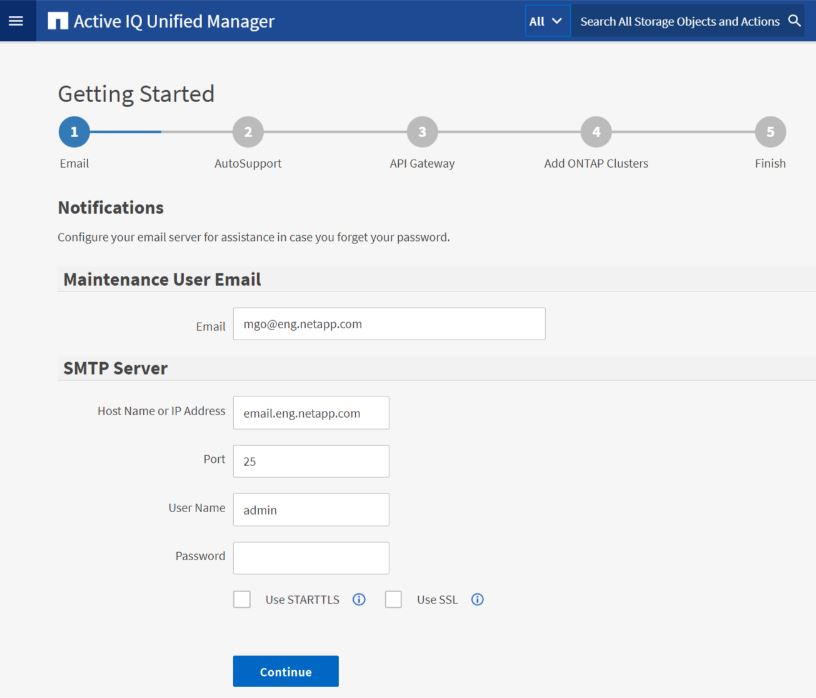

= Esecuzione della configurazione iniziale dell'interfaccia utente Web di Unified Manager
:allow-uri-read: 
:icons: font
:imagesdir: ../media/

[role="lead"]
Per utilizzare Unified Manager, è necessario prima configurare le opzioni di configurazione iniziale, tra cui il server NTP, l'indirizzo e-mail dell'utente di manutenzione, l'host del server SMTP e l'aggiunta di cluster ONTAP.

*Cosa ti serve*

È necessario aver eseguito le seguenti operazioni:

* Ha avviato l'interfaccia utente Web di Unified Manager utilizzando l'URL fornito dopo l'installazione
* Accesso effettuato utilizzando il nome utente e la password di manutenzione (utente umadmin per installazioni Linux) creati durante l'installazione

La pagina Guida introduttiva di Active IQ Unified Managerviene visualizzata solo quando si accede per la prima volta all'interfaccia utente Web. La pagina riportata di seguito è tratta da un'installazione su VMware.

Se si desidera modificare una di queste opzioni in un secondo momento, è possibile selezionare una delle opzioni generali nel riquadro di navigazione sinistro di Unified Manager. Tenere presente che l'impostazione NTP è valida solo per le installazioni VMware e può essere modificata in un secondo momento utilizzando la console di manutenzione di Unified Manager.

.Fasi
. Nella pagina Configurazione iniziale di Active IQ Unified Manager, immettere l'indirizzo e-mail dell'utente di manutenzione, il nome host del server SMTP e le eventuali opzioni SMTP aggiuntive e il server NTP (solo installazioni VMware). Quindi fare clic su *continua*.
+
[NOTE]
====
Se è stata selezionata l'opzione *Use STARTTLS* or *Use SSL* (Usa STARTTLS* o *Use SSL*), dopo aver fatto clic sul pulsante *Continue* viene visualizzata una pagina di certificato. Verificare i dettagli del certificato e accettare il certificato per continuare con le impostazioni di configurazione iniziali dell'interfaccia utente Web.

====
. Nella pagina AutoSupport, fare clic su *Accetto e continua* per abilitare l'invio di messaggi AutoSupport da Unified Manager a NetAppActive IQ.
+
Se è necessario designare un proxy per fornire l'accesso a Internet per inviare contenuti AutoSupport o se si desidera disattivare AutoSupport, utilizzare l'opzione *Generale* > *AutoSupport* dall'interfaccia utente Web.

. Nei sistemi Red Hat e CentOS, modificare la password utente di umadmin dalla stringa predefinita "`admin`" a una stringa personalizzata.
. Nella pagina Set up API Gateway (Configura gateway API), selezionare se si desidera utilizzare la funzione API Gateway che consente a Unified Manager di gestire i cluster ONTAP che si intende monitorare utilizzando le API REST di ONTAP. Quindi fare clic su *continua*.
+
È possibile attivare o disattivare questa impostazione in un secondo momento nell'interfaccia utente Web da *Generale* > *Impostazioni delle funzioni* > *Gateway API*. Per ulteriori informazioni sulle API, vedere link:../api-automation/concept_get_started_with_um_apis.html["Introduzione alle API REST di Active IQ Unified Manager"].

. Aggiungere i cluster che si desidera gestire con Unified Manager, quindi fare clic su *Avanti*. Per ogni cluster che si intende gestire, è necessario disporre del nome host o dell'indirizzo IP di gestione del cluster (IPv4 o IPv6) insieme alle credenziali del nome utente e della password. L'utente deve avere il ruolo "`admin`".
+
Questo passaggio è facoltativo. È possibile aggiungere cluster in un secondo momento nell'interfaccia utente Web da *Storage Management* > *Cluster Setup*.

. Nella pagina Summary (Riepilogo), verificare che tutte le impostazioni siano corrette e fare clic su *Finish* (fine).

La pagina Getting Started (Guida introduttiva) si chiude e viene visualizzata la pagina Unified Manager Dashboard.
