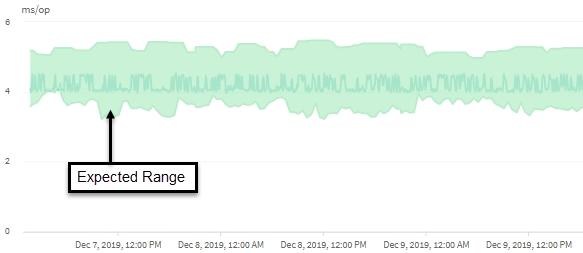

= Come viene utilizzata la previsione di latenza nell'analisi delle performance
:allow-uri-read: 
:icons: font
:imagesdir: ../media/

[role="lead"]
Unified Manager utilizza la previsione della latenza per rappresentare la tipica attività di latenza i/o (tempo di risposta) per i carichi di lavoro monitorati. Ti avvisa quando la latenza effettiva per un carico di lavoro supera i limiti superiori della previsione di latenza, che attiva un evento di performance dinamica, in modo da poter analizzare il problema delle performance e intraprendere azioni correttive per risolverlo.

La previsione della latenza definisce la linea di base delle performance per il carico di lavoro. Nel corso del tempo, Unified Manager apprende dalle precedenti misurazioni delle performance per prevedere i livelli di performance e attività previsti per il carico di lavoro. Il limite superiore dell'intervallo previsto stabilisce la soglia di performance dinamica. Unified Manager utilizza la linea di base per determinare quando la latenza effettiva è superiore o inferiore a una soglia o al di fuori dei limiti previsti. Il confronto tra i valori effettivi e quelli previsti crea un profilo di performance per il carico di lavoro.

Quando la latenza effettiva per un carico di lavoro supera la soglia di performance dinamica, a causa di un conflitto su un componente del cluster, la latenza è elevata e il carico di lavoro funziona più lentamente del previsto. Anche le performance di altri carichi di lavoro che condividono gli stessi componenti del cluster potrebbero essere più lente del previsto.

Unified Manager analizza l'evento di superamento della soglia e determina se l'attività è un evento di performance. Se l'elevata attività del carico di lavoro rimane costante per un lungo periodo di tempo, ad esempio diverse ore, Unified Manager considera l'attività normale e regola dinamicamente la previsione di latenza per formare la nuova soglia di performance dinamica.

Alcuni carichi di lavoro potrebbero avere un'attività costantemente bassa, dove la previsione di latenza per la latenza non ha un elevato tasso di cambiamento nel tempo. Per ridurre al minimo il numero di eventi durante l'analisi degli eventi delle performance, Unified Manager attiva un evento solo per volumi a bassa attività le cui operazioni e latenze sono molto più elevate del previsto.

In questo esempio, la latenza per un volume ha una previsione di latenza, in grigio, di 3.5 millisecondi per operazione (ms/op) al minimo e di 5.5 ms/op al massimo. Se la latenza effettiva, in blu, aumenta improvvisamente a 10 ms/op, a causa di un picco intermittente nel traffico di rete o di un conflitto su un componente del cluster, supera la previsione di latenza e supera la soglia di performance dinamica.

Quando il traffico di rete è diminuito o il componente del cluster non è più in conflitto, la latenza ritorna entro la previsione di latenza. Se la latenza rimane pari o superiore a 10 ms/op per un lungo periodo di tempo, potrebbe essere necessario intraprendere un'azione correttiva per risolvere l'evento.
