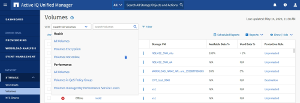

= Comprensione della relazione tra visualizzazione e report
:allow-uri-read: 
:icons: font
:imagesdir: ../media/

[role="lead"]
Le visualizzazioni e le pagine di inventario diventano report quando vengono scaricate o programmate.

È possibile personalizzare e salvare viste e pagine di inventario per il riutilizzo. Quasi tutto ciò che è possibile visualizzare in Unified Manager può essere salvato, riutilizzato, personalizzato, pianificato e condiviso come report.

Nell'elenco a discesa della vista, gli elementi con l'icona di eliminazione sono viste personalizzate esistenti create dall'utente o da un altro utente. Gli elementi senza icona sono viste predefinite fornite con Unified Manager. Le viste predefinite non possono essere modificate o eliminate.

[NOTE]
====
* Se si elimina una vista personalizzata dall'elenco, vengono eliminati anche i file Excel o i report pianificati che utilizzano tale vista.
* Se si modifica una vista personalizzata, i report che utilizzano tale vista rifletteranno la modifica alla successiva generazione e invio del report tramite e-mail in base alla pianificazione del report. Quando si modificano le viste, assicurarsi che le modifiche funzionino con le personalizzazioni Excel associate utilizzate per i report. Se necessario, è possibile aggiornare il file Excel scaricandolo, apportando le modifiche necessarie e caricandolo come nuova personalizzazione Excel per la vista.

====

Solo gli utenti con il ruolo di amministratore dell'applicazione o di amministratore dello storage possono visualizzare l'icona di eliminazione, modificare o eliminare una vista o modificare o eliminare un report pianificato.
