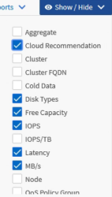

= Personalizzazione delle colonne
:allow-uri-read: 
:icons: font
:imagesdir: ../media/

[role="lead"]
Utilizzare *Mostra/Nascondi* per scegliere le colonne da utilizzare nel report. Trascinare le colonne nella pagina di inventario per riorganizzarle.

.Fasi
. Fare clic su *Mostra/Nascondi* per aggiungere o rimuovere le colonne.
+

. Nella pagina di inventario, trascinare le colonne per riorganizzarle nell'ordine desiderato nel report.
. Assegnare un nome alla vista non salvata per salvare le modifiche.

