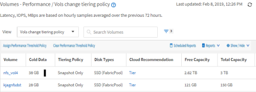
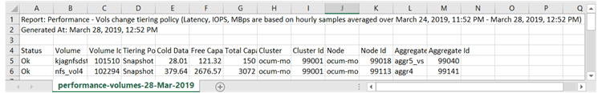

= Avvio rapido dei report
:allow-uri-read: 
:icons: font
:imagesdir: ../media/

[role="lead"]
Crea un report personalizzato di esempio per esplorare le viste e pianificare i report. Questo report di avvio rapido trova un elenco di volumi che potresti voler spostare al livello cloud perché esiste una quantità sufficiente di dati inattivi (cold). Si apre la vista Performance: All Volumes (prestazioni: Tutti i volumi), si personalizza la vista utilizzando filtri e colonne, si salva la vista personalizzata come report e si pianifica la condivisione del report una volta alla settimana.

*Cosa ti serve*

* È necessario disporre del ruolo di amministratore dell'applicazione o di amministratore dello storage.
* È necessario aver configurato gli aggregati FabricPool e avere volumi su tali aggregati.

Attenersi alla procedura riportata di seguito per:

* Aprire la vista predefinita
* Personalizzare le colonne filtrando e ordinando i dati
* Salvare la vista
* Pianificare la creazione di un report per la visualizzazione personalizzata

.Fasi
. Nel riquadro di navigazione a sinistra, fare clic su *Storage* > *Volumes*.
. Nel menu View (Visualizza), selezionare *Performance* (prestazioni) > *All Volumes* (tutti i volumi).
. Fare clic su *Show/Hide* (Mostra/Nascondi) per assicurarsi che la colonna "isk Types `D`" (tipi di disco) venga visualizzata nella vista.
+
image::../media/show_hide_3.png[mostra nascondi 3]

+
Aggiungere o rimuovere altre colonne per creare una vista contenente i campi importanti per il report.

. Trascina la colonna "`Disk types`" accanto alla colonna "`Cloud Recommendation`".
. Fare clic sull'icona del filtro per aggiungere i tre filtri seguenti, quindi fare clic su *Apply Filter* (Applica filtro):
+
** I tipi di disco contengono FabricPool
** Cloud Recommendation contiene Tier
** Cold Data superiore a 10 GBimage:../media/filter_cold_data_2.png[""]

+
Si noti che ogni filtro viene Unito a un logico E che tutti i volumi restituiti devono soddisfare tutti i criteri. È possibile aggiungere un massimo di cinque filtri.

. Fare clic sulla parte superiore della colonna Cold Data (dati a freddo) per ordinare i risultati in modo che i volumi con i dati più a freddo vengano visualizzati nella parte superiore della vista.
. Quando la vista viene personalizzata, il nome della vista è Vista non salvata. Assegnare un nome alla vista in modo che rifletta ciò che viene visualizzato, ad esempio "`VOL change Tiering policy`". Al termine, fare clic sul segno di spunta o premere *Invio* per salvare la vista con il nuovo nome.
+

. Scarica il report come file *CSV*, *Excel* o *PDF* per visualizzare l'output prima di programmarlo o condividerlo.
+
Aprire il file con un'applicazione installata, ad esempio Microsoft Excel (CSV o Excel) o Adobe Acrobat (PDF), oppure salvarlo.

+
[NOTE]
====
È possibile personalizzare ulteriormente il report utilizzando filtri, ordinazioni, tabelle pivot o grafici complessi scaricando la vista come file Excel. Dopo aver aperto il file in Excel, utilizzare le funzionalità avanzate per personalizzare il report. Quando soddisfatto, caricare il file Excel. Questo file, con le sue personalizzazioni, viene applicato alla vista quando viene eseguito il report.

====
+
Per ulteriori informazioni sulla personalizzazione dei report con Excel, consulta _esempi di report Microsoft Excel_.

. Fare clic sul pulsante *Report pianificati* nella pagina dell'inventario. Tutti i report pianificati relativi all'oggetto, in questo caso i volumi, vengono visualizzati nell'elenco.
+
image::../media/scheduled_reports_3.gif[report pianificati 3]

. Fare clic su *Add Schedule* (Aggiungi pianificazione) per aggiungere una nuova riga alla pagina Report Schedule (Pianificazioni report) in modo da definire le caratteristiche di pianificazione per il nuovo report.
. Immettere un nome per il report e completare gli altri campi, quindi fare clic sul segno di spunta (image:../media/blue_check.gif[""]) alla fine della riga.
+
Il report viene inviato immediatamente come test. Successivamente, il report viene generato e inviato via email ai destinatari elencati utilizzando la frequenza specificata.

+
Il seguente report di esempio è in formato CSV:

+

+
Il seguente report di esempio è in formato PDF:

+
image::../media/pdf_sample_report.gif[report di esempio pdf]

In base ai risultati mostrati nel report, è possibile utilizzare Gestione di sistema di ONTAP o l'interfaccia CLI di ONTAP per modificare la policy di tiering in "`auto`" o "`all`" per alcuni volumi per trasferire più dati cold al livello cloud.
