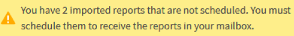

= Pianificazione dei report .rptdesign importati
:allow-uri-read: 
:icons: font
:imagesdir: ../media/

[role="lead"]
È possibile pianificare i report esistenti creati e importati in una release precedente di Unified Manager.

La pianificazione dei report importati richiede quanto segue:

* Report dei file .rptdesign progettati da BIRT importati in una release precedente di Unified Manager
* Applicabile quando si esegue l'aggiornamento a Unified Manager 9.6 GA o versione successiva

Dopo aver eseguito l'aggiornamento a Unified Manager 9.6 GA o versioni successive, la pagina Report Schedules elenca i report importati. È possibile modificare la pianificazione di questi report per specificare gli indirizzi e-mail, la frequenza e il formato del destinatario (PDF o CSV). In caso contrario, questi report non possono essere modificati o visualizzati nell'interfaccia utente di Unified Manager.

.Fasi
. Aprire la pagina Report Schedules. Se sono stati importati report, viene visualizzato un messaggio.
+

. Fare clic sul nome *View* per visualizzare la query SQL utilizzata per generare il report.
+
image::../media/importedreport1.png[importeporte1]

. Fare clic sull'icona Altro image:../media/more_icon.gif[""], Fare clic su *Edit* (Modifica), definire i dettagli della pianificazione del report e salvare il report.
+
[NOTE]
====
È inoltre possibile eliminare i report indesiderati dall'icona Altro image:../media/more_icon.gif[""].

====

