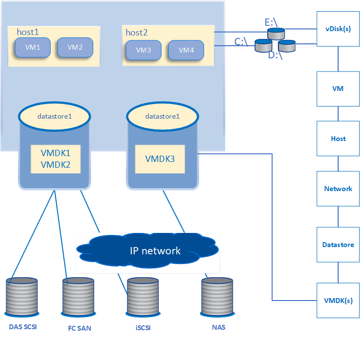

= Monitorare l'infrastruttura virtuale VMware
:allow-uri-read: 
:icons: font
:imagesdir: ../media/

[role="lead"]
Active IQ Unified Manager offre visibilità sulle macchine virtuali (VM) dell'infrastruttura virtuale e consente il monitoraggio e la risoluzione dei problemi relativi a storage e performance nell'ambiente virtuale. È possibile utilizzare questa funzione per determinare eventuali problemi di latenza nell'ambiente di storage o quando si verifica un evento di performance segnalato su vCenter Server.

Una tipica implementazione di un'infrastruttura virtuale su ONTAP include diversi componenti distribuiti tra livelli di calcolo, rete e storage. Eventuali ritardi nelle performance in un'applicazione VM potrebbero verificarsi a causa di una combinazione di latenze affrontate dai vari componenti nei rispettivi layer. Questa funzionalità è utile per gli amministratori di storage e vCenter Server e PER I generalisti IT che devono analizzare un problema di performance in un ambiente virtuale e comprendere in quale componente si è verificato il problema.

È ora possibile accedere a vCenter Server dal menu vCenter della sezione VMware. La vista peek di ciascuna macchina virtuale elencata presenta il collegamento *VCENTER SERVER* nella VISTA DELLA TOPOLOGIA che avvia vCenter Server in un nuovo browser. È inoltre possibile utilizzare il pulsante *Espandi topologia* per avviare vCenter Server e fare clic sul pulsante *Visualizza in vCenter* per visualizzare gli archivi dati in vCenter Server.

Unified Manager presenta il sottosistema sottostante di un ambiente virtuale in una vista topologica per determinare se si è verificato un problema di latenza nel nodo di calcolo, nella rete o nello storage. La vista evidenzia anche l'oggetto specifico che causa il ritardo delle performance per l'adozione di misure correttive e la risoluzione del problema sottostante.

Un'infrastruttura virtuale implementata sullo storage ONTAP include i seguenti oggetti:

* VCenter Server: Un piano di controllo centralizzato per la gestione delle macchine virtuali VMware, degli host ESXi e di tutti i componenti correlati in un ambiente virtuale. Per ulteriori informazioni su vCenter Server, consultare la documentazione VMware.
* Host: Un sistema fisico o virtuale che esegue ESXi, il software di virtualizzazione di VMware, e ospita la macchina virtuale.
* Datastore: I datastore sono oggetti di storage virtuale connessi agli host ESXi. Gli archivi di dati sono entità di storage gestibili di ONTAP, come LUN o volumi, utilizzate come repository per i file delle macchine virtuali, come file di log, script, file di configurazione e dischi virtuali. Sono connessi agli host dell'ambiente tramite UNA connessione DI rete SAN o IP. Gli archivi dati esterni a ONTAP mappati a vCenter Server non sono supportati o visualizzati in Unified Manager.
* VM: Una macchina virtuale VMware.
* Dischi virtuali: I dischi virtuali negli archivi dati appartenenti alle macchine virtuali che hanno un'estensione come VMDK. I dati provenienti da un disco virtuale vengono memorizzati sul VMDK corrispondente.
* VMDK: Disco di una macchina virtuale nel datastore che fornisce spazio di storage per i dischi virtuali. Per ciascun disco virtuale, è disponibile un VMDK corrispondente.

Questi oggetti sono rappresentati in una vista della topologia della macchina virtuale.

*Virtualizzazione VMware su ONTAP*

*Workflow utente*

Il seguente diagramma mostra un tipico caso di utilizzo della vista della topologia della macchina virtuale:

image::../media/vm_workflow.gif[workflow delle macchine virtuali]

== Cosa non è supportato

* Gli archivi dati esterni a ONTAP e mappati alle istanze di vCenter Server non sono supportati da Unified Manager. Non sono supportate anche le macchine virtuali con dischi virtuali su tali datastore.
* Un datastore che si estende su più LUN non è supportato.
* Gli archivi di dati che utilizzano NAT (Network Address Translation) per la mappatura dei dati LIF (access endpoint) non sono supportati.
* L'esportazione di volumi o LUN come datastore su cluster diversi con gli stessi indirizzi IP in una configurazione a più LIF non è supportata in quanto Unified Manager non è in grado di identificare quale datastore appartiene a quale cluster.
+
Esempio: Supponiamo che il cluster A abbia un datastore A. Il datastore A viene esportato tramite dati LIF con lo stesso indirizzo IP x.x.x.x e viene creata una VM A su questo datastore. Analogamente, il cluster B dispone di datastore B. Il datastore B viene esportato tramite dati LIF con lo stesso indirizzo IP x.x.x.x e VM B viene creato nel datastore B. UM non sarà in grado di mappare il datastore A per la topologia della VM A al volume/LUN ONTAP corrispondente né di mappare la VM B.

* Solo i volumi NAS e SAN (iSCSI e FCP per VMFS) sono supportati come datastore, mentre i volumi virtuali (vVol) non sono supportati.
* Sono supportati solo i dischi virtuali iSCSI. I dischi virtuali di tipo NVMe e SATA non sono supportati.
* Le viste non consentono di generare report per l'analisi delle prestazioni dei vari componenti.
* Per la configurazione del disaster recovery (DR) della macchina virtuale di storage (VM di storage) supportata solo per l'infrastruttura virtuale su Unified Manager, la configurazione deve essere modificata manualmente in vCenter Server per puntare ai LUN attivi negli scenari di switchover e switchback. Senza un intervento manuale, i loro datastore diventano inaccessibili.

