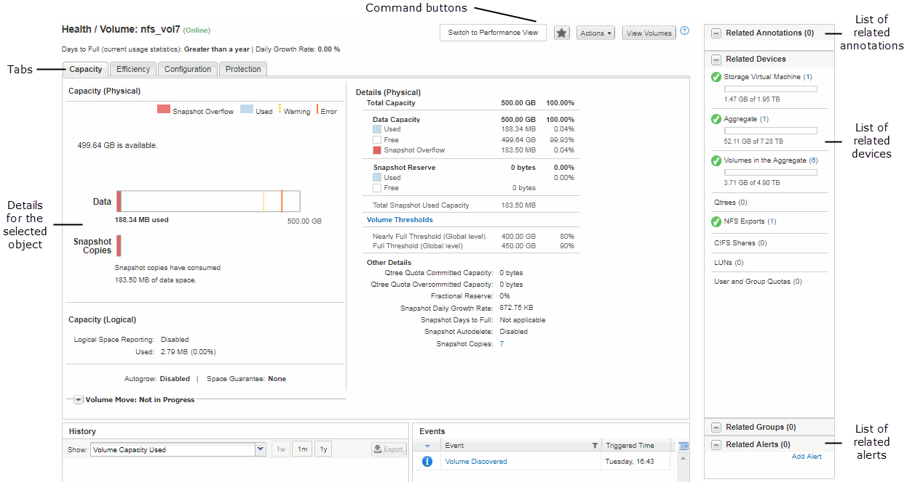

= Layout tipici delle finestre in Active IQ Unified Manager
:allow-uri-read: 
:icons: font
:imagesdir: ../media/

[role="lead"]
La comprensione dei layout tipici delle finestre consente di navigare e utilizzare Active IQ Unified Manager in modo efficace. La maggior parte delle finestre di Unified Manager sono simili a uno dei due layout generali: Elenco oggetti o dettagli. L'impostazione di visualizzazione consigliata è di almeno 1280 x 1024 pixel.

Non tutte le finestre contengono tutti gli elementi dei seguenti diagrammi.

[[object-list-window-layout]]
== Layout della finestra dell'elenco oggetti

image::../media/object_list.png[Uno screenshot della finestra dell'elenco oggetti di Active IQ Unified Manager con i controlli di navigazione, ricerca, filtro e report etichettati]

[[object-details-window-layout]]
== Layout della finestra Dettagli oggetto

